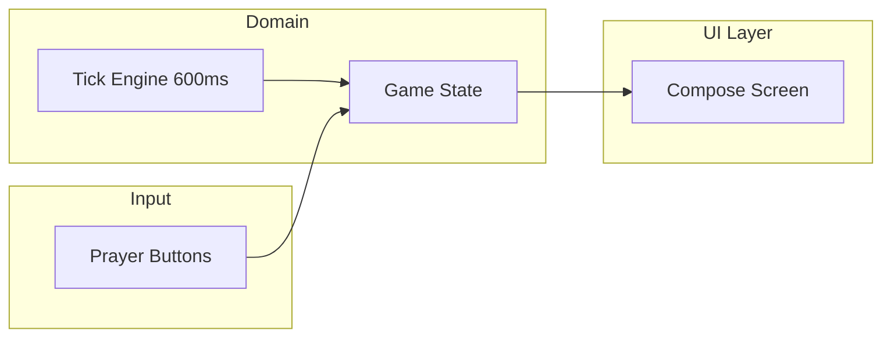

# Phlick – OSRS Prayer Flick Simulator (Android)

## Summary

- **Goal**: Android app that trains players on OSRS’s 600ms tick system by 1-tick alternating between Protect from Magic and Protect from Missiles against two “monsters” attacking on alternating ticks.
- **First iteration**: Single mode, minimal UI, 600ms tick engine, streak counter, correct/wrong feedback. No latency simulation or audio yet (add in a later iteration).
- **Stack**: Kotlin, Jetpack Compose (recommended for simple UI and future sharing with Compose Multiplatform for iOS/web).

---

## 1. Game design (aligned with OSRS)

- **Tick length**: 600ms. All timing is tick-based.
- **Attack pattern**: Two virtual “monsters”, each attacking every **4 ticks**, **1 tick apart**:
  - **Magic monster** attacks on ticks 0, 4, 8, 12, …
  - **Ranged monster** attacks on ticks 1, 5, 9, 13, …
- **Monster representation**: Each monster is shown on screen as a small **geometric shape** (v1 placeholders). Colour convention: **blue = mage**, **green = range**, **red = melee** (for future). Each monster plays a **small animation at the start of its attack** (e.g. scale pulse, glow, or highlight) so the user sees when that monster’s attack cycle begins.
- **Player action**: On an attack tick, the player must have the correct overhead prayer active:
  - On magic attack tick (0, 4, 8, …) → Protect from Magic.
  - On ranged attack tick (1, 5, 9, …) → Protect from Missiles.
- **Evaluation**: Only ticks where a monster attacks are evaluated; ticks 2, 3, 6, 7, … are “idle” (no streak change).
- **Outcome**: Correct prayer when the attack lands → streak +1. Wrong or no switch → streak reset to 0 (and show “miss”).
- **No “game over” in v1**: Just maximize streak; optional “last streak” and “best streak” in UI.

References: [Game tick](https://oldschool.runescape.wiki/w/Game_tick), [Prayer](https://oldschool.runescape.wiki/w/Prayer), [Prayer flicking](https://oldschool.runescape.wiki/w/Prayer#Prayer_flicking).

---

## 2. Architecture



- **Tick engine**: Single source of truth for time. Emits “tick N” every 600ms (using a precise scheduler, e.g. `Choreographer` + elapsed time or `SystemClock.elapsedRealtime()` so ticks don’t drift).
- **Game state**: Current tick index, current “required” prayer (magic or ranged), player’s selected prayer, streak, best streak.
- **Input**: Two controls (or one “swap” control) for Magic vs Missiles. Input is sampled at tick boundary: “which prayer was active when this tick was processed?”
- **UI**: Compose screen that shows state and buttons; no need for a full MVVM stack in v1—a single state holder (ViewModel or plain class) is enough.

---

## 3. Project setup

- **Language**: Kotlin.
- **Build**: Gradle (Kotlin DSL).
- **Min SDK**: 24 (or 26 for simpler life).
- **UI**: Jetpack Compose; single-Activity (Compose).
- **Structure**:
  - `app/` – Android app module.
  - Packages: `ui` (screens), `game` (tick engine, game state, rules), `data` (optional: persistence for best streak later).

No backend; everything local.

---

## 4. Core implementation

### 4.1 Tick engine

- **API**: Start/stop; stream or callback of tick index (0, 1, 2, …) every 600ms.
- **Implementation**: Use a single loop/timer that:
  - Waits 600ms (or 600ms minus elapsed since last tick).
  - Fires “tick” with index `tickIndex++`.
- Prefer **elapsed real time** (e.g. `SystemClock.elapsedRealtime()`) to compute next fire so that 600ms is accurate even if the main thread is briefly busy. Options:
  - `Handler(Looper.getMainLooper())` + `postDelayed` with computed delay.
  - Or `kotlinx.coroutines` `delay` in a scope that’s tied to the game lifecycle (so we don’t drift over long sessions).
- **Rule**: Tick N:
  - If N % 4 == 0: magic monster attacks → required prayer = Magic. If N % 4 == 1: ranged monster attacks → required prayer = Missiles. Otherwise no attack (no evaluation).
  - On attack ticks only: compare “player’s current prayer” with required prayer; update streak or reset.

### 4.2 Game state

- `currentTick: Int`
- `requiredPrayer: Prayer?` (Magic or Missiles only on attack ticks; null on idle ticks).
- `selectedPrayer: Prayer?` (what the user has “active”).
- `streak: Int`
- `bestStreak: Int`
- `lastResult: Result?` (Correct / Wrong) for immediate feedback.
- **Attack tick flags** (for UI animation): `magicMonsterAttackingThisTick: Boolean`, `rangedMonsterAttackingThisTick: Boolean` (derived from tick: true when tick % 4 == 0 and tick % 4 == 1 respectively).

State updates happen in one place (e.g. when tick fires): compute whether it’s an attack tick and which monster; set animation flags; on attack ticks only, compare to `selectedPrayer`, set `lastResult`, update `streak` and `bestStreak`.

### 4.3 Input (prayer selection)

- Two buttons: “Protect from Magic” and “Protect from Missiles” (and optionally “None”).
- On tap: set `selectedPrayer` to that prayer and keep it until the next tap. No need to “turn off” for v1; alternating is done by tapping the other prayer every tick.
- **Evaluation**: When tick N is processed, use the **current** `selectedPrayer` (already set by user before the tick). So the user must switch every 600ms to match the upcoming tick.

### 4.4 Optional: “Swap” single button

- One button that toggles between Magic and Missiles each tap. Same logic: at tick time, compare `selectedPrayer` to `requiredPrayer`.

---

## 5. UI (bare bones v1)

- **Top**: Title (“Phlick” or “Prayer Flick Trainer”).
- **Monster row**: Two “monster” representations side by side:
  - **Mage monster**: Small geometric shape (e.g. circle or triangle), **blue**. Plays a **short animation when its attack starts** (ticks 0, 4, 8, …), e.g. scale up/down pulse, brief glow, or outline highlight (duration ~1 tick or less so it’s clear it’s “attack start”).
  - **Range monster**: Small geometric shape, **green**. Same style of **attack-start animation** on its ticks (1, 5, 9, …).
  - Convention for future: red = melee. Shapes can be distinct (e.g. circle vs diamond) so mage/range/melee are recognizable at a glance.
- **Center**:  
  - Two large buttons (or one toggle): **Protect from Magic** and **Protect from Missiles**.  
  - Use placeholder icons or text labels; later replace with wiki-sourced icons.
- **Feedback**:  
  - Current streak: “Streak: 12”.  
  - Best streak: “Best: 45”.  
  - Optional: short text or color flash “Correct!” / “Wrong!” on attack ticks only (or only on wrong).
- **Start/Stop**: “Start” begins the tick engine and resets streak; “Stop” pauses and keeps best streak.

No complex graphics beyond the monster shapes and their attack animation; focus on readability and responsiveness (buttons must feel instant).

---

## 6. Assets (icons and sounds)

- **Icons**: [Protect from Magic](https://oldschool.runescape.wiki/w/Protect_from_Magic), [Protect from Missiles](https://oldschool.runescape.wiki/w/Protect_from_Missiles), [Protect from Melee](https://oldschool.runescape.wiki/w/Protect_from_Melee). Wiki content is CC BY-NC-SA 3.0; image files are typically under the wiki’s File namespace (e.g. `File:Protect_from_Magic.png`). For v1, use **placeholder drawables** (e.g. colored circles or text) so the app runs without asset approval; add real wiki assets in a follow-up (download and add to `res/drawable`, with attribution in app).
- **Sounds**: Wiki links to sound effect files; same licensing. For v1, **omit sound** or use system UI sounds; add “audio control” and prayer sounds in a later iteration.

---

## 7. File and module layout

- `build.gradle.kts` (root) – project config, Android Gradle Plugin.
- `settings.gradle.kts` – app module.
- `app/build.gradle.kts` – Compose, Kotlin, minSdk 24/26.
- `app/src/main/java/com/phlick/` (or your package):
  - `MainActivity.kt` – Compose setContent, single screen.
  - `game/TickEngine.kt` – 600ms tick source.
  - `game/GameState.kt` or `game/PrayerFlickState.kt` – state + evaluation.
  - `ui/PrayerFlickScreen.kt` – Compose UI (monsters, buttons, streak, feedback).
  - `ui/MonsterView.kt` – Reusable monster representation (geometric shape + attack-start animation); takes attack style (mage/range/melee) and “attacking this tick” flag.
  - `ui/Theme.kt` – minimal Material theme.
- `app/src/main/res/` – `drawable` placeholders, `values/colors.xml`, `themes.xml` if needed.

---

## 8. Future iterations (not in v1)

- **Latency simulation**: Add ±50ms (or configurable) jitter to each tick so “600ms” becomes 550–650ms; option in settings.
- **Audio**: Toggle for sounds; play a distinct sound for “correct” vs “wrong”; optional tick metronome.
- **Protect from Melee**: Third prayer; puzzles with melee + magic + ranged on different tick offsets.
- **Inferno-style waves**: Multiple monsters with different attack speeds (reference [Inferno monsters](https://oldschool.runescape.wiki/w/Inferno#Monsters)); later.
- **iOS / Web**: Share game and tick logic in a `shared` module; use **Compose Multiplatform** for UI on Android, iOS, and desktop/web. First ship Android-only; then add `composeMultiplatform` and `ios/` and `web/` targets.

---

## 9. Implementation order

1. Create Android project (Kotlin, Compose, single Activity).
2. Implement tick engine (600ms, start/stop, tick callbacks).
3. Implement game state and evaluation (required prayer from tick index, streak, best streak).
4. Build minimal Compose UI: monster row (two shapes, blue mage / green range) with attack-start animation driven by `magicMonsterAttackingThisTick` / `rangedMonsterAttackingThisTick`; two prayer buttons; streak, best, start/stop.
5. Wire tick engine → state → UI and button taps → state.
6. Add simple “Correct” / “Wrong” feedback on attack ticks (e.g. Snackbar or short text).
7. Add placeholder drawables (geometric shapes for monsters); polish labels; test on device/emulator.
8. (Later) Replace placeholders with wiki icons; add settings for latency and audio.

---

## 10. Dependencies (app/build.gradle.kts)

- `implementation(platform("androidx.compose:compose-bom:..."))`
- `implementation("androidx.compose.ui:ui")`
- `implementation("androidx.compose.material3:material3")`
- `implementation("androidx.activity:activity-compose:1.8.x")`
- `implementation("androidx.lifecycle:lifecycle-viewmodel-compose:2.6.x")` (optional for v1; can use `mutableStateOf` in a holder class).

No network or database required for v1.

---

## Mock-up (text)

```
+------------------------------------------+
|  Phlick – Prayer Flick Trainer           |
+------------------------------------------+
|  Streak: 0    Best: 0                    |
|                                          |
|    (blue)         (green)                |
|   [Mage]        [Range]                 |
|  monster       monster                   |
|   shape         shape                    |
|  [anim when    [anim when                |
|   tick%4==0]    tick%4==1]                |
|                                          |
|  [ Protect from Magic ]  [ Protect from  |
|       (icon/label)            Missiles ] |
|                                          |
|  [ Start ]            [ Stop ]           |
|                                          |
|  "Correct!" / "Wrong!" (on attack ticks)  |
+------------------------------------------+
```

- **Monsters**: Mage = small blue geometric shape (e.g. circle); Range = small green geometric shape (e.g. diamond or square). Each plays a short “attack start” animation only on its attack ticks (mage every 4 ticks starting 0, range every 4 ticks starting 1).
- Tapping Magic or Missiles sets the “active” prayer. On attack ticks only, the engine checks: if active prayer matches the required one, streak increases; otherwise streak resets and “Wrong!” is shown.

If you want, next step is to generate the actual project files (Gradle, `MainActivity`, `TickEngine`, `GameState`, and Compose screen) so you can open the project in Android Studio and run it.
